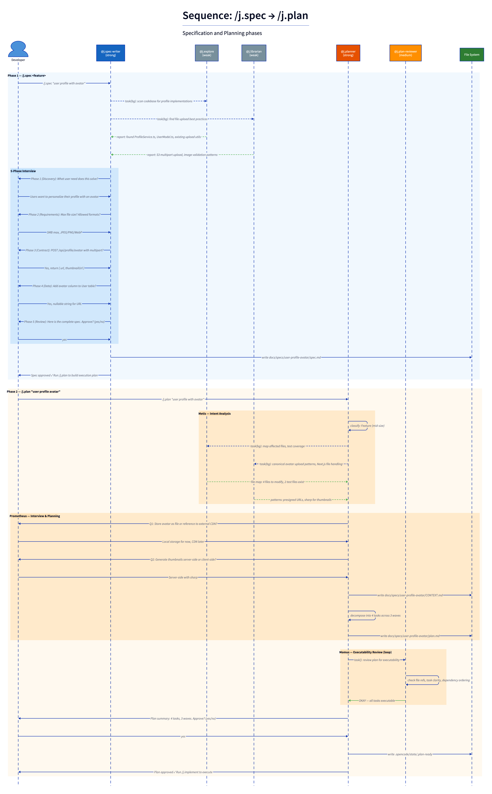

# juninho

Bootstrap the **Agentic Coding Framework** into any [OpenCode](https://opencode.ai) project in a single command. Multi-stack support for Node.js, Python, Go, Java/Kotlin, and generic projects.

## Install

```bash
npm install -g @kleber.mottajr/juninho
```

## Usage

```bash
# Navigate to your project
cd my-opencode-project

# Run setup — auto-detects project type
juninho setup

# Or specify type explicitly
juninho setup --type python

# Output:
# [juninho] Installing Agentic Coding Framework...
# [juninho] ✓ Project type: Python
# [juninho] ✓ Framework installed successfully!
# [juninho] Open OpenCode — /j.plan, /j.spec and /j.implement are ready.
```

### Supported project types

| Type | Detection | Skills |
|------|-----------|--------|
| `node-nextjs` | `package.json` with `next` dep | 9 (all skills) |
| `node-generic` | `package.json` without `next` | 5 |
| `python` | `pyproject.toml`, `requirements.txt`, `setup.py` | 5 |
| `go` | `go.mod` | 5 |
| `java` | `pom.xml`, `build.gradle`, `build.gradle.kts` | 5 |
| `generic` | Fallback | 4 |

Java projects with Kotlin (`build.gradle.kts` with kotlin plugin or `.kt` files) automatically get Kotlin-specific lint (ktlint/detekt), test patterns, and skills.

---

## How It Works

The framework orchestrates a multi-agent AI workflow for spec-driven development. The developer never codes directly — instead, specialized agents handle planning, implementation, validation, and closeout through slash commands.

### Specification & Planning

`/j.spec` conducts a 5-phase interview (Discovery → Requirements → Contract → Data → Review) with background codebase and external research. `/j.plan` runs 3 phases: Metis (intent analysis), Prometheus (interview + decomposition), and Momus (executability review). Both require explicit developer approval.



### Implementation, Verification & Closeout

`/j.implement` executes wave-by-wave with git worktrees for parallelism. Each task follows the READ → ACT → COMMIT → VALIDATE loop. `@j.validator` gates every task against the spec. Pre-commit hooks run lint + related tests. `/j.check` runs repo-wide verification. `/j.unify` reconciles delivery, merges worktrees, updates docs, and creates a PR.


### Context Injection & Plugin Architecture

12 plugins intercept every tool call across 5 tiers to inject context and enforce quality. External knowledge flows through Context7 (library docs) and Context-Mode (semantic search) MCP servers.


| Tier | Mechanism | What it provides |
|------|-----------|-----------------|
| **1** | `j.directory-agents-injector` | Hierarchical AGENTS.md (root → parent → current dir) |
| **2** | `j.carl-inject` (CARL) | Content-aware principles + domain docs via keyword matching (≤8KB) |
| **3** | `j.skill-inject` | File pattern → SKILL.md injection (e.g., `*.test.ts` → test-writing skill) |
| **4** | Plan `<skills>` declarations | Per-task required skills from plan.md |
| **5** | State files + `j.memory` | Cross-session persistent context |

### Agent Roles

| Agent | Model | Role |
|-------|-------|------|
| `@j.spec-writer` | Strong | 5-phase interview → spec.md |
| `@j.planner` | Strong | 3-phase planning → plan.md |
| `@j.implementer` | Medium | Wave execution, READ→ACT→COMMIT→VALIDATE |
| `@j.validator` | Medium | Spec-first validation, BLOCK/FIX/NOTE/APPROVED |
| `@j.plan-reviewer` | Medium | Executability gate for plans |
| `@j.reviewer` | Medium | Post-PR advisory review (read-only) |
| `@j.unify` | Medium | Closeout: merge, docs, PR |
| `@j.explore` | Weak | Read-only codebase research |
| `@j.librarian` | Weak | External docs via Context7 + Context-Mode MCP |

---

## What it creates

`juninho setup` automatically generates:

- **9 agents** in `.opencode/agents/`
- **4–9 skills** in `.opencode/skills/` (filtered by project type)
- **12 plugins** in `.opencode/plugins/` (auto-discovered by OpenCode)
- **4 tools** in `.opencode/tools/` (find-pattern, next-version, lsp, ast-grep)
- **15 slash commands** in `.opencode/commands/`
- **State files** for persistent context and execution tracking
- **Docs scaffold** with AGENTS.md, domain index, principles docs, and manifest
- **Support scripts** in `.opencode/scripts/` for pre-commit, related tests, structure lint, and full checks
- **skill-map.json** for dynamic skill-to-pattern mapping

Then patches `opencode.json` with agent definitions, Context7 MCP, and Context-Mode MCP.

### Slash Commands

| Command | Description |
|---------|-------------|
| `/j.spec` | Feature specification via 5-phase interview |
| `/j.plan` | Strategic planning with 3-phase process |
| `/j.implement` | Execute plan wave-by-wave with validation |
| `/j.check` | Repo-wide verification (typecheck + lint + tests) |
| `/j.unify` | Closeout: merge worktrees, update docs, create PR |
| `/j.pr-review` | Advisory post-PR code review |
| `/j.start-work` | Begin work session with context loading |
| `/j.handoff` | End-of-session handoff document |
| `/j.status` | Show execution state and task progress |
| `/j.ulw-loop` | Ultra work loop (parallel implementation) |
| `/j.init-deep` | Deep codebase initialization (AGENTS.md hierarchy) |
| `/j.sync-docs` | Refresh domain/principles documentation |
| `/j.finish-setup` | Scan codebase, generate dynamic skills + docs |
| `/j.lint` | Run structure lint on staged files |
| `/j.test` | Run tests related to staged files |

## Idempotency

Running `juninho setup` twice is safe — it detects `.opencode/.juninho-installed` and skips if already configured. Use `--force` to reinstall.

## Re-install

```bash
juninho setup --force
```

## CLI Options

```bash
juninho setup [dir] [options]

Options:
  --force          Force reinstall even if already configured
  --type <value>   Project type: node-nextjs, node-generic, python, go, java, generic
  --no-tty         Non-interactive mode (skip prompts)
  --version        Show version number
  --help           Show help
```

## License

MIT
